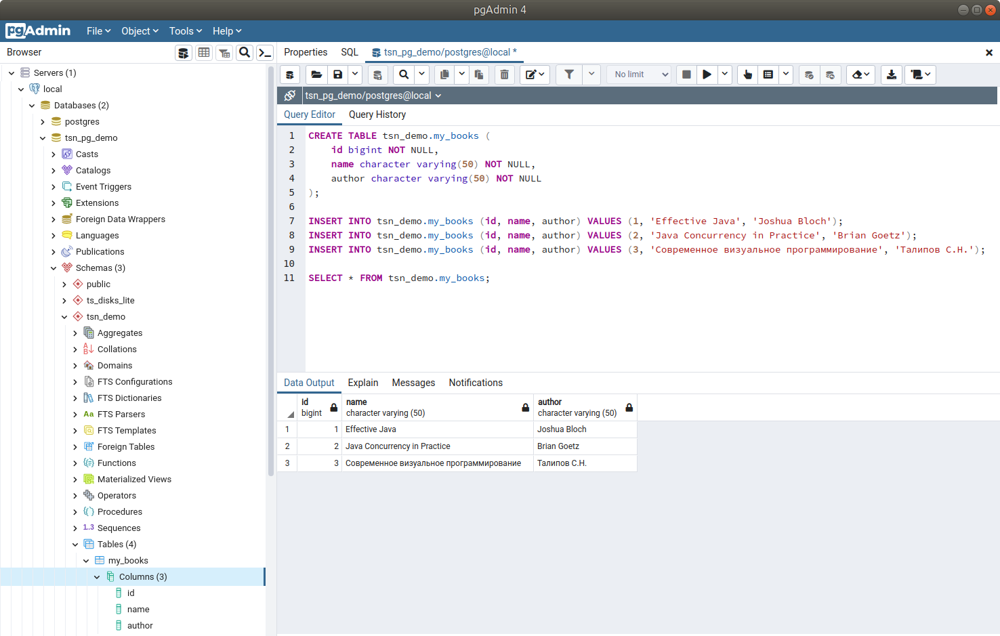
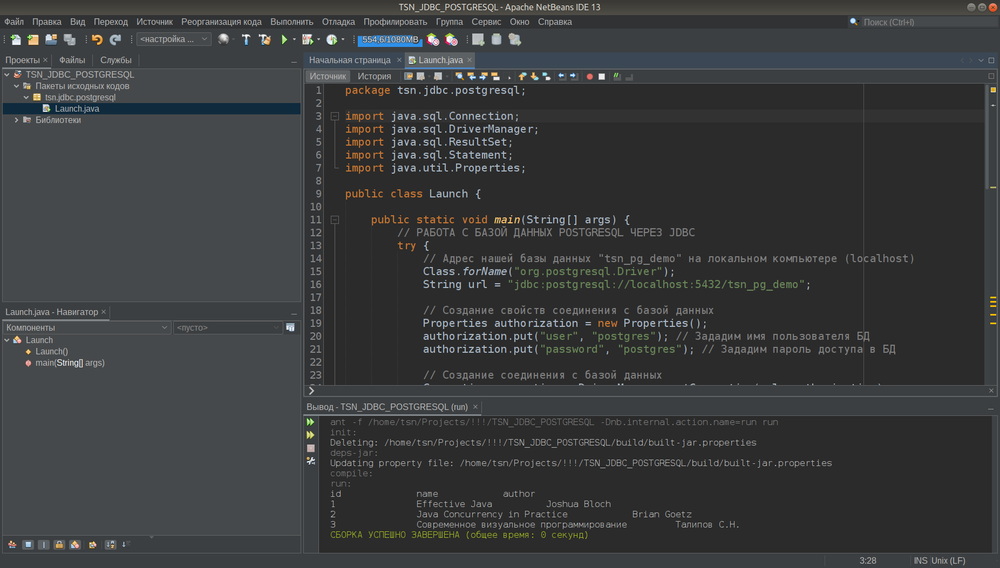

# TSN_JDBC_POSTGRESQL
Простейший пример работы с базой данных PostgreSQL через JDBC в NetBeans





```
CREATE TABLE tsn_demo.my_books (
    id bigint NOT NULL,
    name character varying(50) NOT NULL,
    author character varying(50) NOT NULL
);

INSERT INTO tsn_demo.my_books (id, name, author) VALUES (1, 'Effective Java', 'Joshua Bloch');
INSERT INTO tsn_demo.my_books (id, name, author) VALUES (2, 'Java Concurrency in Practice', 'Brian Goetz');
INSERT INTO tsn_demo.my_books (id, name, author) VALUES (3, 'Современное визуальное программирование', 'Талипов С.Н.');

SELECT * FROM tsn_demo.my_books;
```
